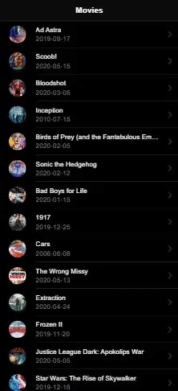

# moviesAPP
Discover popular movies.
## Demo


### Requirements
- [Node](https://nodejs.org/)
- [npm](https://npmjs.com)
- [Ionic](https://ionicframework.com/docs/intro/cli)

### Installation

Clone this repo

```sh
$ git clone https://github.com/superclevver/moviesAPP.git
$ cd moviesAPP
$ yarn install or npm install
```

### How to start
```sh
$ ionic serve
```
